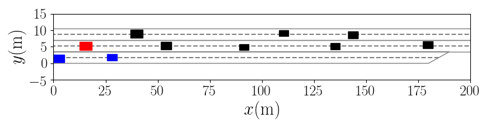
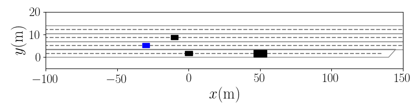

A python3 simulation for interactive multi-lane traffic simulation, e.g. highway, where defining customized entrance and exit lanes are supported as well. This simulation is originally utilized 
for the evaluation of the paper [High-Level Decision Making for Automated Highway Driving via Behavior Cloning](https://ieeexplore.ieee.org/document/9761743).


Fig1. Example of two merging vehicles try to merge to the main lanes.


Fig2. Example of one cooperative agent doing a lane change for the convenience of merging vehicles


# Preparation

Create a python3.6 virtual environment and install all the dependencies via `pip install -r requirements.txt`.

# Running test simulation

Run `python3 simulation_multilane.py`, its `test_load_scene()` function will be executed, where `agents.yml`
and `map.yml` will be loaded to create the customized simulation setup. The rendered forward simulation of this scene will 
be executed.

### Simulation configuration
In each simulation function, e.g. `test_load_scene()`, you could configure the simulation via 
`sim_param = SimulationParameter(0.2, 100, render=True, write_gif=True, show_debug_info=False)`.
The first two parameters are the time interval between steps and the maximum simulation steps. You could choose to render the simulation
with the `render` option. If you want to generate images and gifs for each simulation, simply set the `write_gif=True`, the images of each step
and one gif animation will be generated to an automatically created directory based on your local time.

### Rendering

The rendering of the scene is controlled in the function `add_agents_patch()` of `Simulation` object in `simulation_multilane.py`.
You could visualize the lane change actions with arrows, visualize velocity, accelerations of the agents,
and visualize vehicles in different colors according to the ids, etc.


### Customized map

In `map.yml`, the multi-lane map is defined. The map is constructed with multiple lanes (or so-called corridor), 
each of the lane starts with an unique id >= 0.
Then the left, right bounds and centerline should be parameterized, each with list of 2d-points. The structure of the map is 
settled by assigning each lane a `left_id` and `right_id`, where the ids of the left adjacent lane and right adjacent lane are 
defined. Make sure to set the same coordinates to the shared bounds of two lanes, so that no gap is created between neighboring lanes.
In case of a shorter lane next to a longer lane, e.g. a short merging lane next to a long main lane, the last point of the shared bound of the merging
lane should intersect with the shared bound of the main lane. Additionally, the `type` (`merging`, `exit`, `main`) and the `v_limit` of each lane need to be
specified.

### Customized agents
In `agents.yml`, each agent will start with an unique
id >= 0. In the parameter tree, all the initial states (`x, y, vx, vy, yaw, a, l, w`), corresponding to (x, y positions, 
lateral and longitudinal velocity in frenet frame of the lane, yaw angle, acceleration, length, width), the internal parameters 
(`idm_param, yielding_param, mobil_param`) can be set, along with its behavior model (`idm`, etc.). Currently, rule based and learning based
merging, exit and lane change models are supported, which are listed below. More details about the models please refer to our [paper](https://ieeexplore.ieee.org/document/9761743) above.

#### 1. Lane following model
- `idm`: intelligent driver model. If the agent is locating at the neighboring lane of the merging lane, it will behave cooperative (decelerate) or not,
the cooperativeness is controlled by the `yielding_param`.
#### 2. Lane change models
- `idm_mobil_lane_change`: rule-based [MOBIL lane change model](https://mtreiber.de/publications/MOBIL_TRB.pdf), where [RSS safety](https://www.mobileye.com/technology/responsibility-sensitive-safety/) is not guaranteed during lane change.
- `idm_mobil_lane_change_safe`: rule-based MOBIL lane change model, where RSS safety is guaranteed during lane change.
- `lane_change_learned`: learned lane change model from the paper via Monte-Carlo-Simulation + behavior cloning, where RSS is guaranteed
#### 3. Merging models
- `merging_closest_gap_policy`: rule-based merging model, where RSS is always guaranteed
- `merging_learned`: learned merging model from the paper via Monte-Carlo-Simulation + behavior cloning, where RSS is guaranteed
#### 4. Exiting models
- `exit`: rule-based exiting model, where RSS is always guaranteed
- `exit_learned`: learned exiting model from the paper via Monte-Carlo-Simulation + behavior cloning, where RSS is guaranteed

Note that to initiate proper behavior model according to the initial lane of the agent. E.g. if one agent is initiate on
a merging lane, one of the merging models should be given to the agent. Otherwise, according to the lane located, the behavior
will be adjusted automatically. Therefore, one merging agent will automatically be transformed to an agent with `ìdm_mobil_lane_change`
behavior after finishing merging. If one of the exiting models is assigned, the agent will always try to merge to the most
right lane.

The learned behaviors and some other behaviors are coded with C++ and ported to python with boost python. The reason to use c++
is that the learned behavior need to execute hundreds of Monte-Carlo-Simulation in each decision step and is really time-consuming.
As the paper states, we use multi-thread functionality to speed up the computation. The source code is available as catkin package here [mc_sim_highway](https://github.com/einsteinguang/mc_sim_highway).
In case you have build issues with that package, the built library is already provided in this repo as `mc_sim_highway.so`.

# Customizing your own behavior

`behaviors.py` defines all the behaviors. Each behavior will receive one `observed_model` (`Environment` object in `environment.py`) 
and an `agent` (ego vehicle, `Agent` object in `agent.py`) as input, and outputs `DecoupledAction` object as control commands,
which contains the longitudinal acceleration, lateral velocity and the centerline object of the lane. 

In order to generate your desired behavior, you could use all the functionality of the `observed_model` and `agent` to get the information
about the surrounding traffic and the ego vehicle, e.g. getting neighboring agents with `observed_model.neighbor_around_agent(agent.id)`,
getting ego lane with `observed_model.corridor_for_agent(agent.id)`. More usage please check the existing behaviors as examples.

After defining your own behavior function, you need to add it to the `def plan(self, observed_env):` function of the `Agent` object and give it a name.

If you want your behavior being automatically selected based on the locating lane of the agent, you need to modify the function 
`match_agents_on_corridor()` in `Environment` object.

# Generating random traffics

There are three existing scripts that you can use to generate random traffic for merging, free lane change and exit scenarios, i.e.
`evaluation_exit.py`, `evaluation_merging.py` and `evaluation_lane_change.py`. They all contain one `generate_random_merging_traffic()` function.
In this function, you could specify the lanes and their relations, and most importantly, specify the random traffic on each lane with parameter
`RandomDensityAndVelocityParameter` on each lane. Additionally, you could specify the ratio of agents in the scene that do lane changes
regardless of RSS safety, to simulate aggressive/distracted agents. You could define the ratio of trucks as well, that has larger
geometry and less dynamic internal parameters to simulate the real behavior of trucks.

After setting the number of random initial scenes with `epoch` and running the script, it will generate all the scenes and save them 
separately in your repository named with your local time, as yaml files, similar to the `test_scene/epoch0/*.yml`.

# Massive evaluation of behaviors on random generated traffics

You could rename the directory that contains all the generated scenes as you want, and execute another function in 
`evaluation_exit.py`, `evaluation_merging.py` and `evaluation_lane_change.py`, i.e. `def evaluate_recorded_*_scenes()`, 
just by changing the `root_dirs` to the ones you have generated.

As an example, the `evaluate_recorded_exit_scenes()` in `evaluation_exit.py` utilize 500 random scenes, choose the second and the fourth
agent of each lane as ego agent, and run the simulation respectively. For each ego agent, the simulation will be run with 3 different 
exiting policies `exit`, `exit_learned`, `exit_learned` where the maximum risk of the policy is constrained (details referring to the paper).

All the statistics will be saved and the console output will be saved into one txt file as well. For example:

```commandline
processing epoch0
exit with id 12: 1 exit agents, num finish exit 1, num fallback 0, average t 13.2, utility ego 0.775, comfort ego 0.711 utility obj 0.782, comfort obj 0.519
exit_learned with id 12: 1 exit agents, num finish exit 1, num fallback 0, average t 13.4, utility ego 0.757, comfort ego 0.696 utility obj 0.817, comfort obj 0.519
exit_learned with id 12: 1 exit agents, num finish exit 1, num fallback 0, average t 13.4, utility ego 0.747, comfort ego 0.676 utility obj 0.769, comfort obj 0.519
exit with id 13: 2 exit agents, num finish exit 2, num fallback 0, average t 11.2, utility ego 0.846, comfort ego 0.583 utility obj 0.702, comfort obj 0.519
exit_learned with id 13: 2 exit agents, num finish exit 2, num fallback 0, average t 9.6, utility ego 0.935, comfort ego 0.583 utility obj 0.765, comfort obj 0.519
exit_learned with id 13: 2 exit agents, num finish exit 2, num fallback 0, average t 9.6, utility ego 0.953, comfort ego 0.583 utility obj 0.765, comfort obj 0.519
exit with id 20: 3 exit agents, num finish exit 3, num fallback 0, average t 11.4, utility ego 0.787, comfort ego 0.399 utility obj 0.742, comfort obj 0.519
exit_learned with id 20: 3 exit agents, num finish exit 3, num fallback 0, average t 11.2, utility ego 0.788, comfort ego 0.399 utility obj 0.744, comfort obj 0.519
exit_learned with id 20: 3 exit agents, num finish exit 3, num fallback 0, average t 11.6, utility ego 0.781, comfort ego 0.399 utility obj 0.738, comfort obj 0.544
exit with id 21: 4 exit agents, num finish exit 4, num fallback 0, average t 8.6, utility ego 0.77, comfort ego 0.163 utility obj 0.765, comfort obj 0.519
exit_learned with id 21: 4 exit agents, num finish exit 4, num fallback 0, average t 8.6, utility ego 0.77, comfort ego 0.163 utility obj 0.738, comfort obj 0.519
exit_learned with id 21: 4 exit agents, num finish exit 4, num fallback 0, average t 9.4, utility ego 0.749, comfort ego 0.188 utility obj 0.725, comfort obj 0.519
processing epoch1
exit with id 13: 5 exit agents, num finish exit 5, num fallback 0, average t 13.2, utility ego 0.938, comfort ego 0.641 utility obj 0.686, comfort obj 0.585
exit_learned with id 13: 5 exit agents, num finish exit 5, num fallback 0, average t 12.8, utility ego 0.908, comfort ego 0.641 utility obj 0.69, comfort obj 0.581
exit_learned with id 13: 5 exit agents, num finish exit 5, num fallback 0, average t 12.0, utility ego 0.894, comfort ego -0.252 utility obj 0.723, comfort obj 0.581
exit with id 14: 6 exit agents, num finish exit 6, num fallback 0, average t 11.2, utility ego 0.856, comfort ego 0.348 utility obj 0.681, comfort obj 0.581
exit_learned with id 14: 6 exit agents, num finish exit 6, num fallback 0, average t 11.0, utility ego 0.856, comfort ego 0.348 utility obj 0.711, comfort obj 0.581
exit_learned with id 14: 6 exit agents, num finish exit 6, num fallback 0, average t 11.0, utility ego 0.86, comfort ego 0.348 utility obj 0.71, comfort obj 0.581
exit with id 21: 7 exit agents, num finish exit 7, num fallback 0, average t 12.8, utility ego 0.904, comfort ego 0.439 utility obj 0.702, comfort obj 0.493
exit_learned with id 21: 7 exit agents, num finish exit 7, num fallback 0, average t 12.8, utility ego 0.916, comfort ego 0.421 utility obj 0.715, comfort obj 0.581
exit_learned with id 21: 7 exit agents, num finish exit 7, num fallback 0, average t 12.8, utility ego 0.908, comfort ego 0.421 utility obj 0.701, comfort obj 0.581
exit with id 22: 8 exit agents, num finish exit 8, num fallback 0, average t 10.6, utility ego 0.806, comfort ego 0.463 utility obj 0.7, comfort obj 0.581
exit_learned with id 22: 8 exit agents, num finish exit 8, num fallback 0, average t 10.6, utility ego 0.789, comfort ego 0.463 utility obj 0.699, comfort obj 0.545
exit_learned with id 22: 8 exit agents, num finish exit 8, num fallback 0, average t 10.6, utility ego 0.802, comfort ego 0.463 utility obj 0.7, comfort obj 0.568
...
```

After running all the 500 scenes, you will get the statistics of e.g. how many vehicles complete the exit, how many vehicles
need to fall back and can not complete the exiting, the average time of completing exiting, etc.

# Citation
```commandline
@ARTICLE{9761743,
  author={Wang, Lingguang and Fernandez, Carlos and Stiller, Christoph},
  journal={IEEE Transactions on Intelligent Vehicles}, 
  title={High-Level Decision Making for Automated Highway Driving via Behavior Cloning}, 
  year={2022},
  pages={1-1},
  doi={10.1109/TIV.2022.3169207}}
```